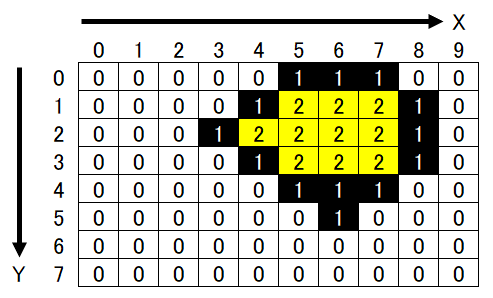
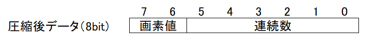

# Tang-Nano_Party-Parrot
Party Parrotが踊ります。  
  

# 仕様
- 内部回路動作周波数：9MHz / 36MHz（オンチップ24MHzオシレータよりPLLで生成）
- 動作確認済みLCD：ATM0430D25

# 画像の格納方法について
Tang-Nanoに搭載されているGW1N-1には18KbitのブロックSRAM(B-SRAM)が4つ内蔵されています。これら4つを連結することで最大72KbitのRAM領域を確保できます。  
対して、格納する画像データは、横128pixel、縦99pixel、色表現2bitで構成されており、1枚あたり約25Kbit必要となります。Party Parrotのgifファイルを分解したところ、10枚の画像で構成されていたため単純計算で250Kbit必要となり、このままではB-SRAMに収まりません。そこで、ランレングス符号化を用いて画像データを圧縮することにしました。  
圧縮のルールは以下のとおりです。  

- 圧縮後の1ブロックのサイズは8bitとする。[7:6]に色情報、[5:0]に画素連続数を格納する。
- 画像の左上(0, 0)を開始点として、X軸方向に順に走査していく。右端(127, 0)に達すると、(0, 1)から引き続き走査していく。
- 走査中に画素値が変化する or 画素値が変化しない状態が63pixel以上継続した場合は、圧縮データとして1ブロック出力する。
- 終端(127,127)まで走査すると終了。

例えば、以下のような横幅10pixel、縦幅8pixelの画像に対して処理を行うことを考えます。  
  
開始点(0,0)の画素値は0であり、X方向に順に走査していくと5画素目で画素値が0から1に変化しています。画素値0の連続数は5ですので、「画素値0が5pixel連続したよ」という情報を1ブロック出力します。1ブロックのデータは以下のように8bitで表されます。  
  
すなわち、「画素値0が5pixel連続したよ」というのは、0x05と表現されるわけです。これを画像の終端まで繰り返します。  
図の例では、0x05 0x43 0x06 0x41 0x83 0x41 0x04 ・・・ となります。  
このような圧縮方法により、画像一枚あたり平均で4960bit（無圧縮時の約1/5）に圧縮することができました。  
風景写真のように隣接する画素で頻繁に画素値が変わるようなデータには向きませんが、白板に書いた文字のように、ほとんどの領域が同一画素値で塗りつぶされているようなデータでは高い圧縮率が期待できます。身近な例ではモノクロファクシミリ（FAX）でデータ圧縮する際に使われているようです。  
圧縮された画像を展開する際には、ROMから1Byte読み出して連続数分画素値を出力した後、ROMアドレスを1進めて同様に繰り返すだけの非常に簡単な処理となります。  
実際にFPGAに組み込む際には、ROM（B-SRAM）に1クロック（または2クロック）のレイテンシが存在するため注意が必要です。今回は少し強引ですが、ROMに供給するクロックを画素走査クロックの4倍とすることで、レイテンシを無視できる設計としています。

# 開発環境
- IDE : GOWIN FPGA Designer Version1.9.2.02 Beta build(35976)

# Resource Usage Summary:
|  Resource  |  Usage |  Utilization  |
| ---------- | ------ | ------------- |
|  Logics  |  314/1152  | 27% |
|  --LUTs,ALUs,ROM16s  |  314(186 LUTs, 128 ALUs, 0 ROM16s)  | - |
|  --SSRAMs(RAM16s)  |  0  | - |
|  Registers  |  130/945  | 13% |
|  --logic Registers  |  118/864  | 13% |
|  --I/O Registers  |  12/81  | 14% |
|  BSRAMs  |  4/4  | 100% |

